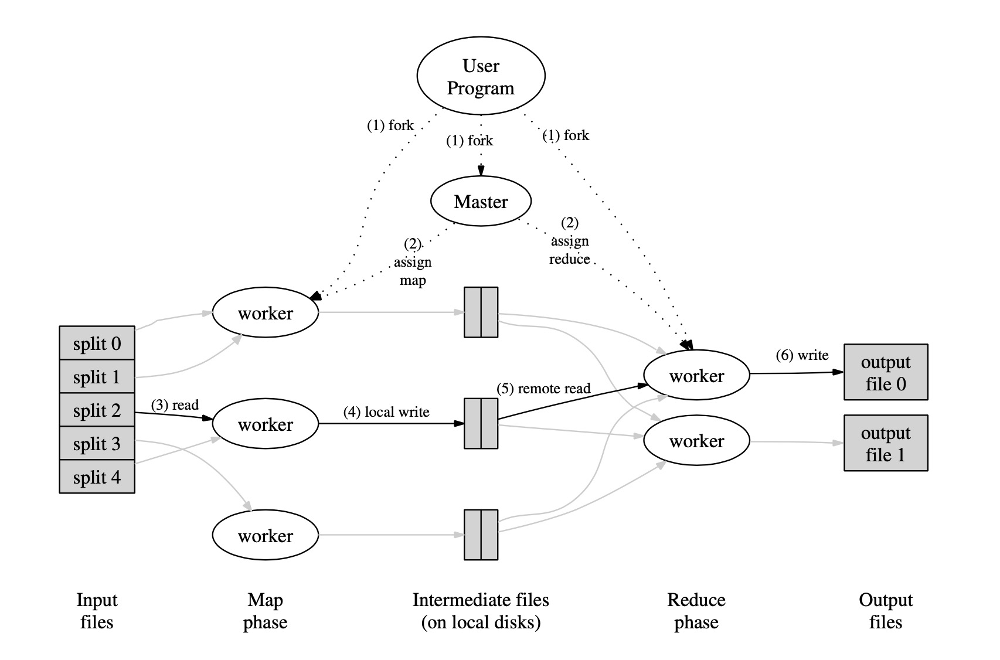

[toc]

# MapReduce 论文

	## 编程模型

### Map

​	由用户编写，通过输入对来获取一些中间键值对的集合。

### Reduce

​	由用户编写，接受一个中间键并且与该中间键对应的值的集合。这些值合并起来形成一个更小的数据集。一般来说，一次`Reduce`产生一或零个输出。

## 执行概览

### 执行顺序如下

- 在用户程序中的MapReduce库将用户输入氛围M份，每份大小在16MB～64MB之间。并且在多个机器上启动相同的程序。
- 最特殊的是Master节点。剩下的为Worker节点，这些Worker节点由Master节点分配任务。其中有M个`map`任务被分配，R个`reduce`任务被分配。Master节点选择空闲的worker节点来执行`map`任务或者`reduce`任务。
- 被分配到`map`任务的worker节点获取到相对应的切割好的内容。其将内容转换为kv键值对，并且将这些键值对传入到定义好的`Map`函数当中。而这些处理过后的中间键值对将会被存储在内存当中。
- 同时，这些缓存的键值对会被写入到磁盘当中。将会被R区域的分区函数进行分区。这些缓存的键值对在磁盘当中的位置会被发送回到master节点当中。而master节点负责将这些位置告诉分配到`reduce`的worker。
- 当一个`reduce`worker被通知到数据的位置时。该worker将会通过rpc调用的方式从本地磁盘当中读取数据。当`reduce`worker读取了所有的中间键值对时，他会将这些数据根据key值进行排序。所以拥有相同key的value将会排列在一起。这个排序是很有必要的，因为很多不同的key值将会送入到一个`reduce`worker当中。如果数据太庞大，那么就会用到外部的排序。
- `reduce`worker便利这些排序好的中间数据，对于每一个唯一的中间键，worker将会将这个键值所对应的value集合送入到`reduce`函数当中。而`reduce`函数当中的数据将会追加到输出文件当中。
- 当所有的`map`以及`reduce`工作结束后，master节点唤醒用户程序。这时，就是用户调用MapReduce函数的返回。

## Master节点的数据结构

​	其对于每一个正在执行任务的worker节点，保存其对应的状态。以及每一个worker所对应的ID。

​	对于每一个完成的`map`worker节点，master保存其输出的大小以及其所在的磁盘位置。对这些数据的更新意味着`map`worker节点的完成。而这些对应的信息将会持续的推送给正在执行`reduce`任务的worker节点。

## 容错Fault Tolerance

### Worker错误

​	Master节点会周期性的PingWorker节点。若在一定时间内，Master节点没有收到来自Worker节点的回复，那么Master节点则认为该Worker节点失败。任何由该Worker节点完成的`Map`任务将会重新设置为空闲状态。因此，这些任务能被其余的空闲Worker执行。相同的，任何正在执行在失败Worker伤的的`Map` 或者是`Reduce`任务都会被重新设置为空闲状态，等待被重新的分配。

​	完成的任务仍然需要重新执行的原因是这些输出都被存在在失败Worker节点的本地节点当中，而因为这些节点失败了所以他们会变得无法访问。而那些完成的`Reduce`任务不需要被重新执行，因为他们已经被输出到了GFS当中。

​	当一个`Map`任务因为一个节点A失败而被另一个节点B重新执行时，所有的正在执行`Reduce`的worker节点都会被通知这一信息。任何没有来得及读取A节点输出的`Reduce`节点将会从B节点继续读取输出。

​	MapReduce系统对Worker节点失败的容忍性很高。

### Master错误

​	让Master节点定期的将结构信息进行一个存储是一件很简单的事情。如果一个Master节点死亡，那么就可以创建一个从最新的checkpoint当中恢复Master节点信息。尽管，对于单一Master节点而言，Master节点是不容易死亡的。因此，我们当前的实现是：当Master节点死亡，我们会终止MapReduce。客户可以察觉到这一情况，并且按他们的需要选择是否重新出发MapReduce。

