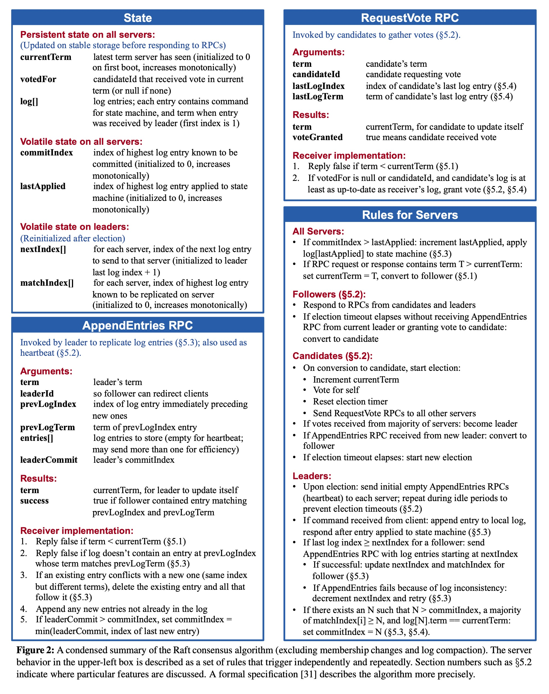

# MIT-6.824-Distributed-System
Never lose the desire for learning.

Course Site: https://pdos.csail.mit.edu/6.824/schedule.html

## MapReduce
done

## Raft
https://pdos.csail.mit.edu/6.824/labs/lab-raft.html

- 2A finished ✅
- 2B finished ✅
- 2C finished ✅
- 2D finished ✅
done

## Fault-tolerant Key/Value Service
https://pdos.csail.mit.edu/6.824/labs/lab-kvraft.html
- 3A
  - Clerks send `Put()`, `Append()`, and `Get()` RPCs to the kvserver whose associated Raft is the leader
  - If the Clerk sends an RPC to the wrong kvserver, or if it cannot reach the kvserver, the Clerk should re-try by sending to a different kvserver.
  - All the kvservers execute operations from the Raft log in order, applying the operations to their key/value databases;
  - Your kvservers should not directly communicate; they should only interact with each other through Raft.
  - Each server should execute Op commands as Raft **commits** them
  - If a leader fails just after committing an entry to the Raft log, the Clerk may not receive a reply, and thus may re-send the request to another leader. 
  - Each call to `Clerk.Put()` or `Clerk.Append()` should result in just a single execution, so you will have to ensure that the re-send doesn't result in the servers executing the request twice.